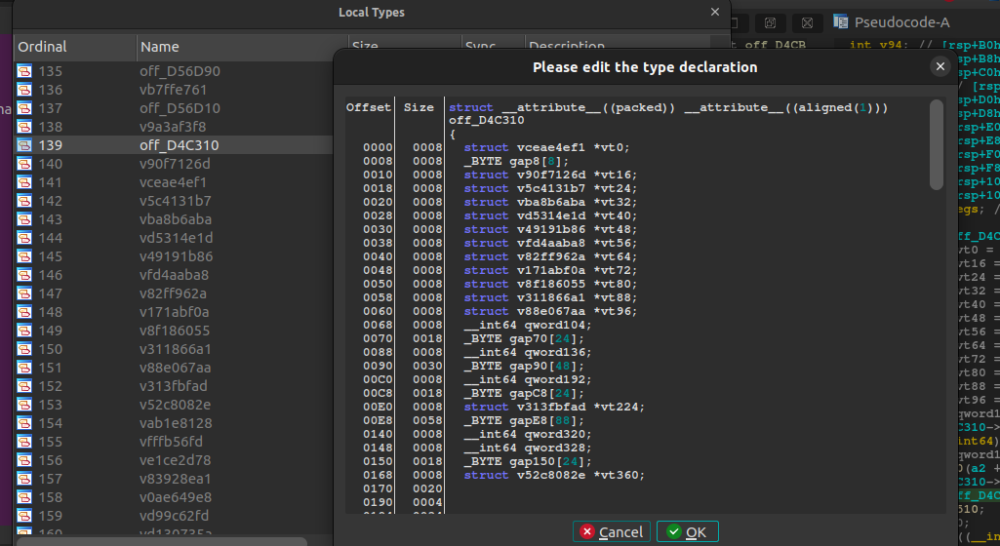

# ClassMaker
A simple IDA plugin to make classes automatically

#### Disclaimer

Don't watch the sources if you don't want your eyes to bleed, this is originally just a script I wrote in a week while learning (debugging and reversing the code source) IDA python for my own personal use, just wanted to share it in case someone would have a use for it.

If more than me and my colleagues use it, maybe I'll gather the courage to clean the code and document it.

---

## How it works

This script uses the pseudocode of IDA to create the structure and reconstruct the vtable(s) that corresponds to the class you're looking at. It means it'll work on every architucture your IDA supports. It's dumb, it just follows the address of the vtable, make the computation if the adress is relative to an offset, then goes 4 by 4 or 8 by 8 depending on your architecture (yes, so far it only supports 32/64, I had no use for something else, but it's 2 lines to add for more, so just ask if I don't have the need for it before) and check if the address in question is the start of a function. It stores everything, create a struct in ida with a random name, and so on until all the vtables in your constructor has been reconstructed.

It then does some simple "create struct type" that doesn't work as well as create struct type (but there is no possibility to use create struct type in IDA python, I asked, and what a hell it is to re-do a full create struct type in ida python), guess the name of the class thanks to the last assignement in the first vtable, and voilà. If the heuristic for the name appears to be wrong, you're free to change it yourself. I mostly made this script to reconstruct the vtables and gain some time during the reverse of my target.

I do not believe in current "auto class makers" that tries to reconstruct the whole binary. By essence, it relies in heuristics, heuristics that can fails, and I rather take a bit more time doing it myself than lose a week on a pseudocode I trusted too much. Hence why don't hope for any upgrades pointing that way. I count on people better than me for that.

## Limitations

* The code doesn't dive into the functions inside the constructor.
* I know and I'll update it at some point, if you encounter a constructor that substract an offset from a reference to get to its vtable (`vt0 = refVtable - 2`), it won't work, I don't handle sub asg. Should be very rare though.
* Some member assignations and assignations only made in parameters of functions within the constructor won't be recognized. If there is too much of them, you can use "create new struct type" prior to my script, call the structure the same way my script would call the class, and then apply the plugin. It will keep the existing structure and just edit it.
* Do not work on class constructed into the stack, the variable must be a pointer.

## How to use

Once the script is loaded, locate the variable that will hold the first vtable of your class, click on it, and then press '4'. Click away on the script so IDA refreshes the GUI, and it should be done. If the script asks you for a class name, you either have no symbols whatsoever, or most likely, it failed.

Before the use of the plugin, note where the cursor his, make sure to make it point on the variable that holds the vtable.

And then you press '4' (or change it within the script for whatever you want) and the class is made.

## TODO

* Cross ref every constructor calls to propagate the class everywhere it should be propagated.
* Try to find a reliable way to handle automatically classes within classes. Maybe use that iteration to dive into sub functions also for the class members reconstruction.

 ---
### Last word

As it relies on the pseudocode, I may not have thought about all the kind of assignations IDA can produce, and I may not have encounter all of them myself. Feel free to get in touch if you have an IDB that has a case that I don't handle, either by doing a PR or by contacting me through my twitter: https://twitter.com/ShiroPycatchown.

This is some work that I share for free, please be polite if you have a request as I don't owe anyone anything. That being said I hope it'll make your life easier for some of you as it does for me during my C++ reversing.
